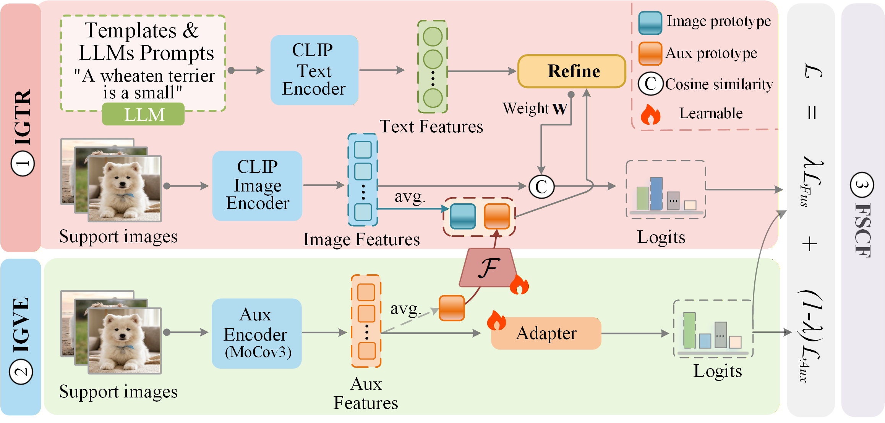

# CVTR: Co-Fusion CLIP via Visual-Text Rectification for Few-shot Learning


## Introduction
This paper proposes a novel Co-Fusion CLIP via Visual-Text Rectification (CVTR) framework to address semantic-shift-induced visual bias and high-uncertainty predictions for CLIP-based few-shot classification. Specifically, our CVTR utilizes Visual-Anchored Text Calibration (VATC) to mitigate semantic shift via visual guidance, and Instance-Anchored Visual Calibration (IAVC)  to support textual refinement during training and reduces prediction uncertainty via patch-level optimal matching during inference. Finally, a coordinate fusion strategy (FSCF) balances the rectified visual and textual logits at the loss level. The experiments are conducted on eleven benchmark datasets, and the results show CVTR outperforms representative methods under zero-shot and few-shot settings while exhibiting robust cross-domain generalization.
<div align="center">
  
</div>

## Requirements
### Installation

Create a conda environment and install dependencies:
```bash
git clone https://github.com/fhqxa/CVTR
cd CVTR

conda create -n CVTR python=3.8
conda activate CVTR

pip install -r requirements.txt

# Install the according versions of torch and torchvision
conda install pytorch torchvision cudatoolkit
```

### Dataset
Our dataset setup is primarily based on Tip-Adapter. Please follow [DATASET.md](https://github.com/gaopengcuhk/Tip-Adapter/blob/main/DATASET.md) to download official ImageNet and other 10 datasets. The `datasets/` folder contains all downloaded datasets, where each dataset is stored in a separate subdirectory with the standard train/val/test splits.

### Foundation Models
* The pre-tained weights of **CLIP** will be automatically downloaded by running.
* The pre-tained weights of **MoCo-v3** can be download at [MoCo v3](https://github.com/facebookresearch/moco-v3).

## Get Started

### One-Line Command by Using `run.sh`

We provide `run.sh`  which you can run AMU-Tuning in an one-line command.
```bash
sh run.sh
```

### Arguments
- `clip_backbone` is the name of the backbone network of CLIP visual coders that will be used (e.g. RN50, RN101, ViT-B/16).  
- `uncent_type`: the type of uncertainty estimation (e.g., entropy, energy, max, variance).

  `uncent_power`: a scaling factor applied to the uncertainty score.

  `gamma`: a temperature parameter used in similarity normalization.

  `kurtosis_threshold`: the threshold used to identify uncertain queries based on kurtosis.
- `alpha` is used to control the effect of logit bias.  
- `lambda_merge`  is a hyper-parameter in **Aux Training**.  

More arguments can be referenced in [parse_args.py](https://github.com/TJU-sjyj/AMU-Tuning/parse_args.py).

### Training Example
You can use this command to train a adapter with ViT-B-16 as CLIP's image encoder by 16-shot setting for 50 epochs.  

```bash
CUDA_VISIBLE_DEVICES=0 python train.py \
    --rand_seed 2 \
    --torch_rand_seed 1 \
    --exp_name cvtr_16_shot \
    --clip_backbone "ViT-B-16" \
    --augment_epoch 1 \
    --alpha 0.5 \
    --lambda_merge 0.35 \
    --train_epoch 50 \
    --lr 1e-3 \
    --batch_size 8 \
    --shots 16 \
    --root_path "/path/to/your/datasets" \
    --prompt_path "./Prompt_CuPL" \
    --use_patch_matching \
    --use_coarse_filter \
    --kurtosis_threshold 2.5 \
    --fusion_type "similarity" \
    --load_aux_weight
```

## Result
<p align="center">
  
</p>
*Figure: Comparison of average accuracy across 11 datasets.*

## Acknowledgement
This repo benefits from [Tip-Adapter](https://github.com/gaopengcuhk/Tip-Adapter), [CaFo](https://github.com/OpenGVLab/CaFo), and [AMU-Tuning](AMU_TUNING_LINK). Thanks for their excellent works.


## Contact
If you have any questions or suggestions, please feel free to contact us at: zh1127@mnnu.edu.cn and hongyichencn@163.com.

